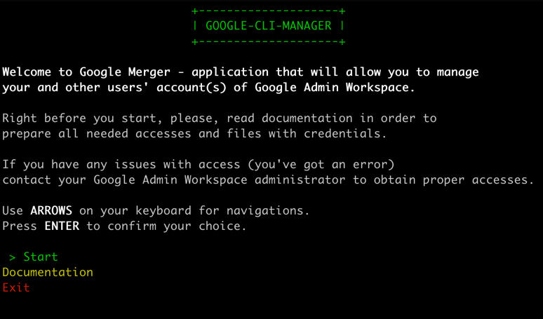
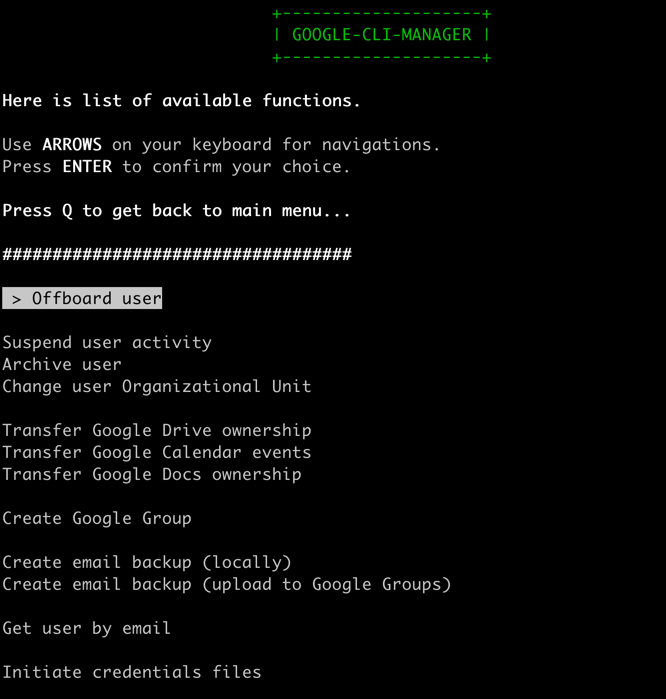

# Table of Contents
1. [Introduction and scope](#introduction-and-scope)
2. [Requirements](#requirements)
3. [Installation and usage](#installation-and-usage)
4. [Credentials](#credentials)
5. [Available functions](#available-functions)
   1. [Admin workspace](#admin-workspace)
   2. [Calendar](#calendar)
   3. [Docs](#docs)
   4. [Drive](#drive)
   5. [Gmail](#gmail)
   6. [Groups](#groups)
   7. [Initiate credentials](#initiate-credentials)
6. [References and Contact](#references-and-contact)

---

### Introduction and scope
**Google CLI Manager** - is the simple _Python terminal-based application_ 
that allows to manage Google organizational account(s) via _CLI_. 
Using this program allows to manage next Google services:

- **Google Admin workspace**
- **Google Calendar**
- **Google Drive**
- **Google Docs**
- **Gmail**

Application allows to manage access for resources between different users, change Organizational Units, transfer Google Calendar 
events and create local and remote (using [Google Groups](https://groups.google.com)) emails backups.

Application is available in 2 versions - _interactive CLI_ and _classic terminal-based application_.

---

### Requirements 

In order to use application, you need to have installed Python version 3+ on your computer. To check that, open terminal, type `python3 --version` and press `ENTER`. You should see next:
```
~ % python3 --version
Python 3.9.6
```
If you don’t see such outcome, please, go to official Python programming language page, and, according to instructions, install it.

---

### Installation and usage

- For **MacOS** and **Linux**:

To install Google CLI Manager on your computer open terminal, paste and execute next command:
```
bash <(curl -s -S -L "https://raw.githubusercontent.com/bl4drnnr/google-cli-manager/master/install.sh")
```
After installation is done, restart terminal.

Type `gmcli -h` to check if everything was installed correctly.

The usage of the program is available in 2 versions:
- **Interactive CLI** - To execute program as Interactive CLI, type `gmcli`. Use arrows on a keyboard to navigate menu and `ENTER` to confirm select.
- **Classic terminal application** - If you want to execute program in classic terminal application mode, it'll be enough to type `gmcli -h` to list all possible commands.

To use **Interactive CLI** use arrows on your keyboard for navigation and `ENTER` to confirm your choose.

Here is how the main window look like. From here you can start, print documentation or exit.



By clicking `Start` you will be redirected to window with list of all available functions.
This is the main window of the program, by choosing operation here, you will be ask to
provide needed data.



---

### Credentials

In case of first execution of the application you will be asked (or you can do it
on your own) to generate credentials in order to internal functionalities.

First **"set"** of credentials that you need is:
- Client ID
- Client Secret
- Project ID
- Delegated user email (basically, your email)

`Client ID` and `Client Secret` can be found [here](https://console.cloud.google.com/apis/credentials).
Just click in `EDIT` button  for `Google CLI manager credentials` (right side) and copy out of there
those credentials.

This will only allow you to use services, that don't require **Service Account**, but, if
you did everything correctly, on step with generating credentials, you will get a
link. Click in it, and click **Authorize** button.

This will generate **Service Account**. And that's it, **you are ready to go now!**

**_In case, if you don't have access to this functionality, please, contact your Google Workspace administrator in order to obtain those accesses. Otherwise, functions won’t be available to use!_**

---

### Available functions

Remember, **some endpoints are available only within organization**, therefore,
if you want to access them, you need to use Service Account and
Delegate Authority in **Google Admin**.

In case, if you don't have access to this functionality, please, contact
your **Google Admin** administrator in order to obtain credentials.

#### Admin workspace

- **Offboard user** - general procedure (organizations only), that deactivates user's account by doing next:
  1. Suspend user's activity.
  2. Change user Organizational Unit.
  3. Transfer Google Drive ownership.
  4. Transfer Google Calendar events.
  5. Create emails backup using Google Groups.

- **Suspend user activity** - Suspends user's activity. Account isn't archiving, therefor activity can be restored at any moment.
- **Archive user** - archive user's account.
- **Change user Organizational Unit** - Changes Organizational Unit user belongs to. Can be used from pool of existing ones.
- **Get user by email** - allows to get information about user in format of JSON file.

#### Calendar

- **Transfer Google Calendar events** - Transfers events from one Google Calendar to another. Transfer is done by sending email with proposition to add events to person how has to receive events of sender person.

#### Docs

- **Transfer Google Docs ownership** - Transfers ownership of all Docs files. Ownership is transferred only for files that have been created by this user.

#### Drive

- **Transfer Google Drive ownership** - Transfers ownership of all files on Google Drive. Ownership is transferred only for files that have been created by this user.

#### Gmail

- **Create email backup (locally)** - Creates backup of emails locally. Files saved as database and can be used as local backup, but also with purpose  the restoration and creating Google Group with backuped email.
- **Create email backup (upload to Google Groups)** - Creates backup of emails and uploads it as Google Group. Before using this option, you need to have already created group on Google Groups. In order to create group go to [Google Groups](https://groups.google.com/) and create groups. Created group's email will be used to upload backuped data.

#### Groups

- **Create Google Group** - creates Google Group. As input data waits for name, delegated used email, and [Customer ID](https://support.google.com/a/answer/10070793?product_name=UnuFlow&hl=en&visit_id=638025357933773524-789296966&rd=1&src=supportwidget0&hl=en). Used in order to back up emails using Google Group, but can be used as single operation.

#### Initiate credentials

- **Initiate credentials files** - allows to generate or generate credentials files. Use in case of first execution or if credentials were changed. **Service account will be overwritten!**

---

### References and contact

- Developer contact - [mikhail.bahdashych@protonmail.com](mailto:mikhail.bahdashych@protonmail.com)
- [Google Developers](https://developers.google.com/) - Official SDKs by Google
- [Google Calendar API](https://developers.google.com/calendar/api) - **Google Calendar** for developers
- [Google Gmail API](https://developers.google.com/gmail/api) - **Google Gmail** for developers
- [Google Drive API](https://developers.google.com/drive/api) - **Google Drive** for developers
- [Google Docs API](https://developers.google.com/docs/api) - **Google Docs** for developers
- [Google Workspace Admin SDK](https://developers.google.com/admin-sdk) - **Google Admin** for developers
- [Google Customer ID](https://support.google.com/a/answer/10070793?product_name=UnuFlow&hl=en&visit_id=638025357933773524-789296966&rd=1&src=supportwidget0&hl=en) - how you can find your customer ID.
- [Using OAuth 2.0 for Server to Server Applications](https://developers.google.com/identity/protocols/oauth2/service-account) - how to create Service Account and delegate authority to it  
- [OAuth 2.0 Scopes for Google APIs](https://developers.google.com/identity/protocols/oauth2/scopes) - list of all OAuth 2.0 scopes
- [Using OAuth 2.0 for Server to Server Applications](https://developers.google.com/identity/protocols/oauth2/service-account) - how to create **Service Account** and **delegate authority to it**
- [OAuth 2.0 Scopes for Google APIs](https://developers.google.com/identity/protocols/oauth2/scopes) - list of all **OAuth 2.0 scopes**
- [Python](https://www.python.org/downloads/) - Download and install `Python`
